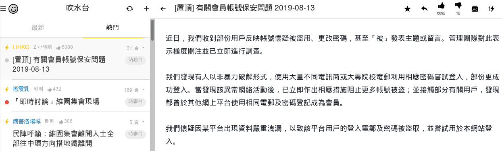
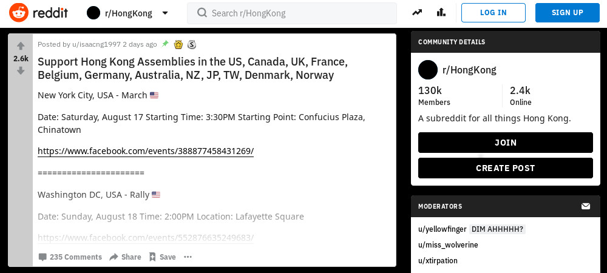
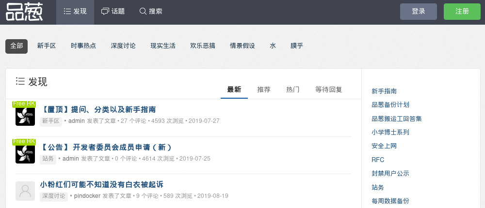
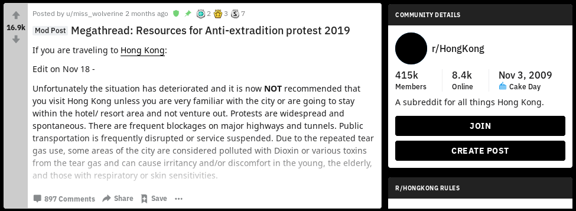
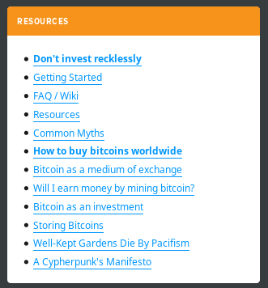
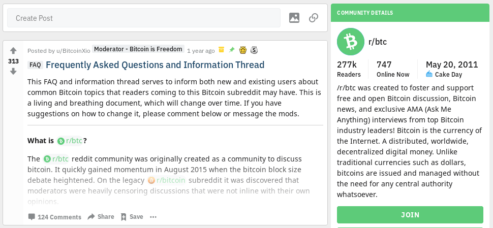
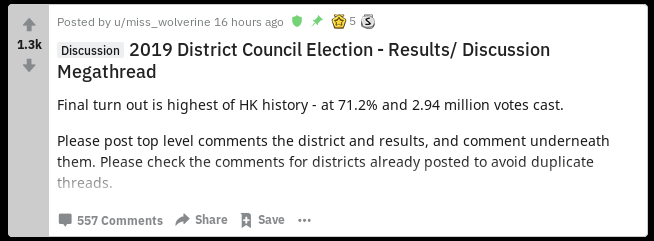
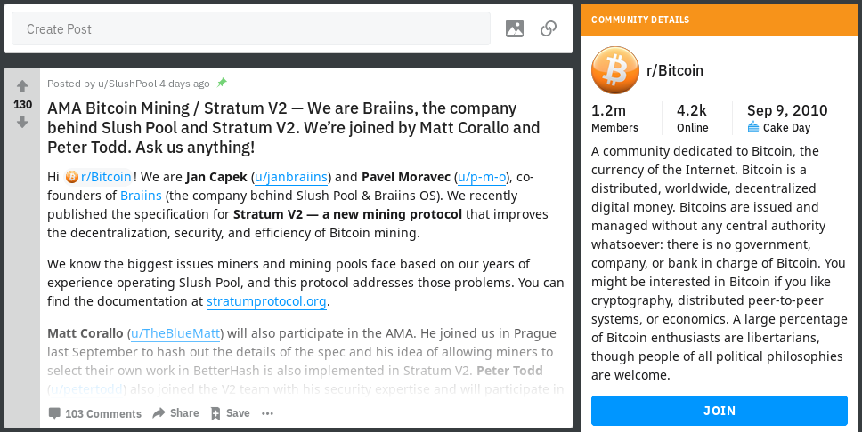
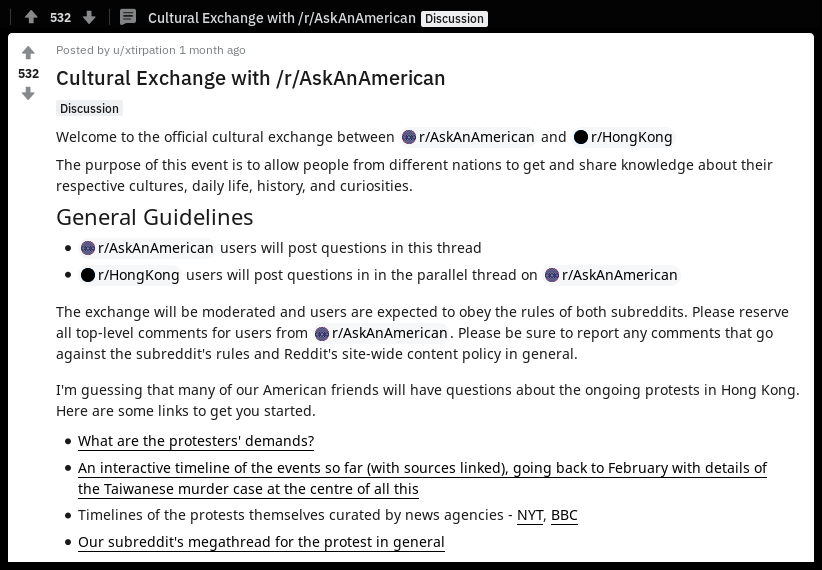
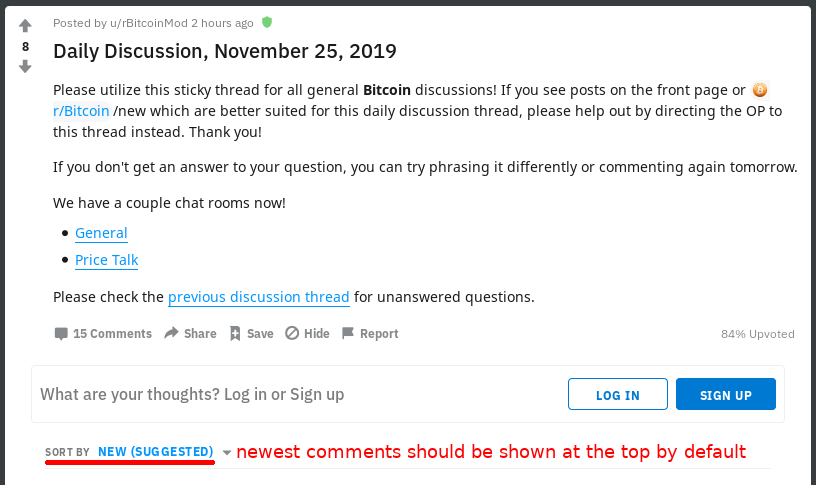

# An Instruction Manual To Decentralized Movements

The purpose of this project is to raise global solidarity, unite people, and exchange valuable knowledge and experience among activists across the world from pro-democracy freedom fighters to civil liberties activists, cryptocurrency advocates, LGBTQ+ activists, environmental activists, human & animal rights activists.

## Go To

- [Abstract](#abstract)
- [Main Idea](#main-idea)
- [Governance](#governance)
- [Web Ecosystem](#web-ecosystem)
- [Operations Security](#operations-security)
- [Public Relations](#public-relations)
- [Digital Resistance](#digital-resistance)
- [Propaganda](#propaganda)
- [Civil Disobedience](#civil-disobedience)
- [Police Brutality](#police-brutality)
- [Street Protests](#street-protests)
- [Equipment](#equipment)
- [Logistics](#logistics)
- [Finance](#finance)
- [Electoral Fraud](#electoral-fraud)
- [Notable Campaigns/Actions/Tactics](#notable-campaigns/actions/tactics)
- [Other](#other)

## Abstract

[Back to navigation](#go-to)

*Disclaimer: Of course, these techniques can be used by a small group of extremists, the same as any kind of knowledge, tech, money, and infrastructure can be used by criminals. However, this guide is focused on techniques that provide good results only if the movement is supported by the majority of people through active participation, financial donations, and engagement on social media.*

Democracy is in danger across the world. Global warming is accelerating. Human and animal rights are abused on a massive scale. Only global solidarity and unite of people across the world can bring us a better future. Decentralized movements proved to be more resilient because they cannot be stopped by the arrest of a few leaders. In this manual we will provide step by step instructions how to organize a sustainable decentralized movement, resist state-backed propaganda and protect from police brutality. 

The theory is an important part of an academic research, but in this manual we will focus of practical suggestions, so activists will be able to pro-actively approach new movements and give them suggestions how to improve their efficiency based on this manual.

All tactics and techniques listed below are based on real examples of relatively decentralized movements such as:

- 2014 Ukrainian revolution
- Hong Kong’s pro-democracy protests
- Russia’s pro-democracy movement
- Catalonia’s pro-independence movement
- Cryptocurrency ecosystem

##  Main Idea

[Back to navigation](#go-to)

*”The movement is only successful if starts with an idea that is strong enough to take root in the mind of population and inspire and motivate people to spread it.”* - [Revolution: An Instruction Manual](https://www.youtube.com/watch?v=8Zq4f6WYmHU)

Such an idea should follow 3 requirements:
1. Clearly defined common interest.
2. A clear vision of what you are working towards.
3. A plan of action.

Examples:

During HK pro-democracy protests of 2019 people had 5 clear demands with an end goal of full democracy, which should be achieved via implementation of universal suffrage.

The cryptocurrency movement has an end goal of destroying government’s monopoly on money creation to make sure that corrupt governments cannot simply print money to fund programs without consent of citizens (e.g., fund wars or bail out bankers).

## Governance

[Back to navigation](#go-to)

A successful decentralized movement should have online forums where people can:

- Organize actions
- Discuss strategies
- Share information

Social media platforms like Twitter, Facebook, or Instagram don’t suit the purpose, because exposure of the content on these platforms depends on the number of followers the author has. That means that well-established accounts will have much higher influence on the movement.

In a highly decentralized movement the decision-making process is very democratic, because any individual can propose an idea using a throw-away account and get a high level of exposure if his idea is valuable for the movement. In other words, exposure of each post or comment should depend on the content of that message, but not on the popularity of its author.

Examples:

HK pro-democracy protests of 2019: [LIHKG](https://lihkg.com/), [Reddit](https://reddit.com/r/HongKong), [Pincong](https://pincong.rocks/).

Cryptocurrency community: [Bitcointalk](https://bitcointalk.org/), [Reddit](https://www.reddit.com/r/cryptocurrency).

Articles:
[Decentralized governance: inside Hong Kong’s open source revolution (LIHKG, Reddit, Pincong, GitHub)](https://medium.com/crypto-punks/decentralized-governance-inside-hong-kongs-open-source-revolution-lihkg-reddit-pincong-519ab2861793)

## Web Ecosystem

[Back to navigation](#go-to)

A highly developed web ecosystem is extremely important for a successful decentralized movement, but we should understand that the system will become useless if the government shuts down an internet in the whole country as it happened in Iran during 2019 protests.

Here are the main purposes that websites and apps should facilitate:

- Decentralized governance
- Public discussions
- Sharing information
- News distribution
- Onboarding new activists
- Education of new activists
- Private communication
- On-the-ground communication
- Crowdfunding
- Storage of photos/videos
- Maps for boycott campaigns
- Maps to track police movements

If there is a lack of resources to develop specialized tools, then all-in-one platforms can be used. For example, a Reddit-like online forum [LIHKG](https://lihkg.com/) has been used during HK protests as a tool for decentralized governance, public discussions, sharing information, and sometimes for onboarding and education of new activists.

Examples:

[LIHKG](https://lihkg.com/) online forum was used by HK activists as a command center, where people could organize events, discuss strategies and share news.

[Tsunami Democratic](https://tsunamidemocratic.github.io/app.html) app was used by Catalan activists for the [coordination of peaceful civil disobedience](https://techcrunch.com/2019/10/17/catalan-separatists-have-tooled-up-with-a-decentralized-app-for-civil-disobedience/). TsunamiD is based on an open-source node-based networking platform [RetroShare](https://retroshare.cc/).

[HKmap.live](https://hkmap.live/) was used by HK activists to track the movement of HK police to avoid clashes, arrests, and police brutality.

[Coin ATM Radar](https://coinatmradar.com/) was used by crypto enthusiasts to find nearby cryptocurrency ATMs.

[collaction.hk](https://www.collaction.hk/lab/extradition_gallery) was used by HK activists to store all protests-related images such as photos, posters, artworks, memes, etc.

[HKrev.info](https://tl.hkrev.info/en/police-timeline/) was used to store evidences of police misconduct.

## Operations Security

[Back to navigation](#go-to)

Since decentralized movements use public forums for decision making process, an adversary (e.g., an authoritarian government) can eavesdrop on most of the communication, so operations security (OPSEC) should be focused on hiding an involvement of single individuals into the movement.

- Surveillance
  - Internet surveillance
  - CCTV cameras
  - RFID scanners
  - Human intelligence

- Privacy & security tips
- Hidden messages

Articles:
[Digital resistance: security & privacy tips from Hong Kong protesters](https://medium.com/crypto-punks/digital-resistance-security-privacy-tips-from-hong-kong-protesters-37ff9ef73129)

Websites:
[Privacytools.io](https://www.privacytools.io)

## Public Relations

[Back to navigation](#go-to)

- Branding
  - Logo
  - End goal
  - Main slogan
  - Anthem
  - Mascots
  - Symbols

- Events
  - Press conferences
  - Other conferences
  - Open mics
  - Movie nights

- Local support
  - Leaflets
  - Posters
  - Banners
  - Flags
  - Cloths
  - Statues
  - Graffiti 
  - Lennon walls
  - More info
    - QR codes
    - Short links
    - Call to action

- International support
  - Translation into other languages
  - Usage of foreign flags
  - Ads in international newspapers
  - Solidarity marches
  - Cultural exchange events
  - Petitions

- Online resource lists
  - Full resource lists for journalists and researchers
  - Short resource lists for onboading new people
    - Info about the movement (wiki page, YouTube videos)
    - News sources (News aggregators, Telegram, Twitter, YouTube channels)
    - Live streams sources (YouTube channels, websites)
    - Free photos/videos for journalists (Websites)
    - How to get involved in the moment
    - How to help the movement from abroad
    - Donation links

- Reddit
  - Onboarding resources
  - Megathreads for important events
  - AMAs
  - Cultural exchanges
  - Dealing with noise
    - Daily discussions
    - More subreddits
    - Memes

Examples:

#### Onboarding resources
A [megathread](https://www.reddit.com/r/HongKong/comments/cxsz4i/megathread_resources_for_antiextradition_protest/) at [r/HongKong](https://www.reddit.com/r/HongKong/) was a great example of onboarding resources lists.

[r/Bitcoin](https://www.reddit.com/r/Bitcoin/) used a side bar to link important resources that can help with onboarding.

The [FAQ](https://www.reddit.com/r/btc/comments/9lfjrb/frequently_asked_questions_and_information_thread/) thread was pinned to [r/btc](https://www.reddit.com/r/btc/) in order to onboard new users and explain the main differences between [r/Bitcoin](https://www.reddit.com/r/Bitcoin/) and [r/btc](https://www.reddit.com/r/btc), because some newcomers could be confused since there were 2 subreddits with similar names.

[r/btc](https://www.reddit.com/r/btc) used “get started” button at the side bar that linked to an external website [bitcoin.com](https://www.bitcoin.com/get-started/).

Many resources were linked at the top menu of [r/btc](https://www.reddit.com/r/btc).

#### Megathreads for important events

During some big live events there might be too many similar posts, so well-moderated subreddits often use megathreads to combine together all discussions about that specific event. E.g., a megathread was used to discuss 2019 District Council Elections at [r/HongKong](https://www.reddit.com/r/HongKong/).

#### AMAs

“Ask Me Anything” (AMA) threads are a good way to bring more attention to the movement, motivate people to engage with the content, and clarify certain misconceptions.

For example, Braiins company started an [AMA session](https://www.reddit.com/r/Bitcoin/comments/dz1mgp/ama_bitcoin_mining_stratum_v2_we_are_braiins_the/) at [r/Bitcoin](https://www.reddit.com/r/Bitcoin/), which was pinned to the top for a few days.

#### Cultural exchanges

Organizing events with people from other subreddits can build a bridge between two similar movements, and increase global solidarity.

For example, [r/HongKong](https://www.reddit.com/r/HongKong/) organized a [cultural exchange](https://www.reddit.com/r/HongKong/comments/dji5k5/cultural_exchange_with_raskanamerican/) event with another subreddit [r/AskAnAmerican](https://www.reddit.com/r/AskAnAmerican/).

#### Dealing with noise

When a sudreddit of the movement becomes big enough, the valuable information might get lost in the noise, so it’s important to keep a conversation focused on the main topic, while still give an opportunity for activists to engage in less-important conversations. This can be achieved with daily discussion threads, chatrooms, and creation of other subreddits.

###### Daily discussions

For example, a [daily discussion](https://www.reddit.com/r/CryptoCurrency/comments/e17gfo/daily_discussion_november_25_2019_gmt0/) thread at [r/CryptoCurrency](https://www.reddit.com/r/CryptoCurrency/).

Daily discussion threads should be sorted by “new” by default in order to facilitate chat-style live conversations.

###### More subreddits

During big price swings, there is often a surge of price-related posts at many crypto-related subreddits, so a moderator [reminded](https://www.reddit.com/r/Bitcoin/comments/e1drny/rbitcoin_is_not_a_price_shoutbox_if_you_wish_to/) to all readers of [r/Bitcoin](https://www.reddit.com/r/Bitcoin/) that the price-related content could be posted at daily discussion threads, in the chatroom, or at another subreddit [r/BitcoinMarkets](https://www.reddit.com/r/BitcoinMarkets/). At the guidelines section in a side bar there was also a link to [r/CryptoCurrency](https://www.reddit.com/r/CryptoCurrency/) subreddit for non-Bitcoin crypto posts.

###### Memes

Memes and artworks are important to raise global awareness and keep people engaged with the issue, but sometimes there might be too many memes and they get lots of upvotes, so valuable information gets lost. The solutions are the same as with discussions: either combine all memes about certain event together into one megathread or move them all to another subreddit.

For example, [r/CryptoCurrency](https://www.reddit.com/r/CryptoCurrency/) had a link to [r/CryptoCurrencyMemes](https://reddit.com/r/cryptocurrencymemes) subreddit at the top menu.

## Digital Resistance

[Back to navigation](#go-to)

- Hashtags
- Memes
- Artworks
- Hidden messages
- Websites
- Wi-Fi hotspots
- Review-bombing
- GDPR requests

## Propaganda

[Back to navigation](#go-to)

- Censorship
- Fake news
- Bots

[Back to navigation](#go-to)

## Civil Disobedience

[Back to navigation](#go-to)

- Passive
  - Boycotts

- Active
  - General strikes
  - Ways
  - Sit-ins
  - Block infrastructure
    - Airports, train & bus stations
    - Bridges & tunnels
    - Roads
      - Roadblocks/barricades
      - Human traffic jams
      - Vehicles traffic jams

## Police Brutality

[Back to navigation](#go-to)

- Riot-control
  - Tactics
  - Less-lethal weapons
    - Batons
    - Pepper spray
    - Tear gas
    - Non-lethal projectiles
      - Rubber bullets
      - Sponge grenades
      - Bean bags
      - Pepper pellets

  - Lethal weapons

  - Vehicles
    - Water cannons
    - Armored trucks

  - Other
    - Police dogs
    - Undercover cops

- Sexual harassments
- Tortures
- Death squads

Articles: [Weapons of mass control, tactics of mass resistance](https://www.reuters.com/investigates/special-report/hong-kong-protests-violence/)

## Street Protests

[Back to navigation](#go-to)

- General
  - Routes
  - Dress code
  - Slogans
  - Banners
  - Supply chains
  - Hands signs

- Roles
  - Frontliner
  - First Aider
  - Engineer
  - Transporter
  - Scout
  - Coordinator

- Barricades
  - Shapes
  - Traffic barriers
  - Pedestrian guardrails
  - Trash bins
  - Bamboo sticks
  - Building materials
  - Bricks
  - Cement with bricks
  - Bags filled with sand/snow/bricks
  - Tables/chairs

- Fluid strategy
  - Tactics

- Stationary strategy
  - Preparation
  - Occupation
  - Defense line
  - Supplies
  - Escape routes
  - Demands

## Equipment

[Back to navigation](#go-to)

- Defense gear
  - Umbrellas
  - Hardhats, Helmets
  - Gaggles
  - Face masks
  - Respirators
  - Heat resistant gloves
  - Raincoats
  - Plastic wraps
  - Makeshift shields
    - Traffic signs
    - Barrels
    - Skateboards
    - Wood panel
    - Bin lid
    - Cardboard boxes
    - Ironing boards

- Offense tools (non-lethal)
  - Laser pointers
  - Flashlights/torches
  - Umbrellas
  - Water bottles
  - Slingshots
  - Eggs

- Med Kit
  - Alcohol/antiseptics
  - Hydrogen peroxide
  - Bandages
  - Band aids
  - Gauze
  - Cotton balls
  - Pain killers
  - Saline solution
  - Small size saline
  - Ventolin
  - Trauma shears/scissors
  - Tweezers

- Other
  - Water bottles
  - Walkie-talkies
  - Tape
  - Cable ties
  - Paint spray
  - Spare cloth
  - Power drills
  - Vacuum cleaners
  - Tennis and badminton rackets
  - Traffic cones
  - Waterproof bags
  - Plastic teapots

## Logistics

[Back to navigation](#go-to)

- Warehouses
- Supply stations
- Collecting supplies
- Transportation
- Distribution

## Finance

[Back to navigation](#go-to)

- Crowdfunding

## Electoral Fraud

[Back to navigation](#go-to)

- Exit polls
- Voter turnout counting
- Independent observers
- “Smart voting” (opposition coalition)

## Notable Campaigns/Actions/Tactics

[Back to navigation](#go-to)

- Ukrainian anti-mask law
- Automaidan/autodozor
- #ProveThatYouCare campaign
- “Smart voting” campaign

#### #ProveThatYouCare campaign

In 2019 Russian-speaking pseudonymous video blogger [ToBeOr](https://www.youtube.com/watch?v=obnWpmbwjco) asked his followers to approach their favorite music artists, movie stars, and other famous people on social media with the hashtag [#ДокажиЧтоНеВсеРавно](https://twitter.com/hashtag/ДокажиЧтоНеВсеРавно), which can be translated as **#ProveThatYouCare**. As a result, many famous rappers, comedians, and video bloggers expressed their discontent with the current regime, attended an upcoming protest, and made anti-government video clips. That was a big change in the society, because before that famous people were usually self-censoring themselves due to potential repercussions for speaking out against the government.

#### “Smart voting” campaign

In 2019 the Russian opposition politician Alexei Navalny with his team [mounted](https://www.rferl.org/a/russia-smart-voting/30153235.html) a [“Smart Voting”](https://vote2019.appspot.com/) campaign to break the monopoly of the ruling party United Russia on regional elections. The idea of “Smart Voting” was to vote unitedly for one particular candidate in each district, who had the most chances to win over the candidate from the ruling party. Fundamentally, this strategy was undemocratic, because people had to vote for a candidate who was picked by Navalny’s team. However, the results were impressive and opposition candidates got much more seats than usually. In some regions the ruling party didn’t get any seats at all.

## Other

[Back to navigation](#go-to)

- Tips and Tricks
