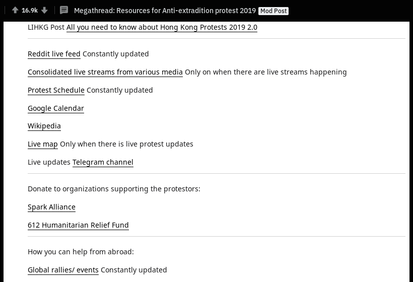
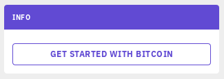
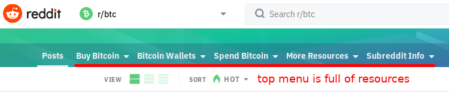
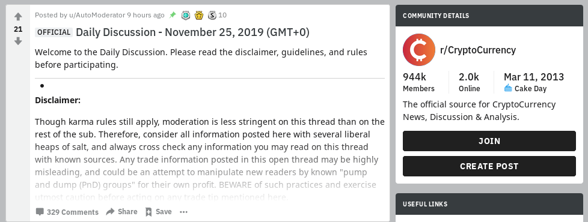

# An Instruction Manual To Decentralized Movements

The purpose of this project is to raise global solidarity, unite people, and exchange valuable knowledge and experience among activists across the world from pro-democracy freedom fighters to civil liberties activists, cryptocurrency advocates, LGBTQ+ activists, environmental activists, human & animal rights activists.

## Go To

- [Abstract](#abstract)
- [Main Idea](#main-idea)
- [Governance](#governance)
- [Web Ecosystem](#web-ecosystem)
- [Operations Security](#operations-security)
- [Public Relations](#public-relations)
- [Digital Resistance](#digital-resistance)
- [Propaganda](#propaganda)
- [Civil Disobedience](#civil-disobedience)
- [Police Brutality](#police-brutality)
- [Street Protests](#street-protests)
- [Equipment](#equipment)
- [Logistics](#logistics)
- [Finance](#finance)
- [Electoral Fraud](#electoral-fraud)
- [Notable Tactics](#notable-tactics)
- [Other](#other)
- [Support the Project](#support-the-project)

## Abstract

[Back to navigation](#go-to)

*Disclaimer: Of course, these techniques can be used by a small group of extremists, the same as any kind of knowledge, tech, money, and infrastructure can be used by criminals. However, this guide is focused on techniques that provide good results only if the movement is supported by the majority of people through active participation, financial donations, and engagement on social media.*

Democracy is in danger across the world. Global warming is accelerating. Human and animal rights are abused on a massive scale. Only global solidarity and unite of people across the world can bring us a better future. Decentralized movements proved to be more resilient because they cannot be stopped by the arrest of a few leaders. In this manual we will provide step by step instructions how to organize a sustainable decentralized movement, resist state-backed propaganda and protect from police brutality. 

The theory is an important part of an academic research, but in this manual we will focus of practical suggestions, so activists will be able to pro-actively approach new movements and give them suggestions how to improve their efficiency based on this manual.

All tactics and techniques listed below are based on real examples of relatively decentralized movements such as:

- 2014 Ukrainian revolution
- Hong Kong’s pro-democracy protests
- Russia’s pro-democracy movement
- Catalonia’s pro-independence movement
- Cryptocurrency ecosystem

##  Main Idea

[Back to navigation](#go-to)

*”The movement is only successful if starts with an idea that is strong enough to take root in the mind of population and inspire and motivate people to spread it.”* - [Revolution: An Instruction Manual](https://www.youtube.com/watch?v=8Zq4f6WYmHU)

Such an idea should follow 3 requirements:
1. Clearly defined common interest.
2. A clear vision of what you are working towards.
3. A plan of action.

Examples:

During HK pro-democracy protests of 2019 people had 5 clear demands with an end goal of full democracy, which should be achieved via implementation of universal suffrage.

The cryptocurrency movement has an end goal of destroying government’s monopoly on money creation to make sure that corrupt governments cannot simply print money to fund programs without consent of citizens (e.g., fund wars or bail out bankers).

## Governance

[Back to navigation](#go-to)

A successful decentralized movement should have online forums where people can:

- Organize actions
- Discuss strategies
- Share information

Social media platforms like Twitter, Facebook, or Instagram don’t suit the purpose, because exposure of the content on these platforms depends on the number of followers the author has. That means that well-established accounts will have much higher influence on the movement.

In a highly decentralized movement the decision-making process is very democratic, because any individual can propose an idea using a throw-away account and get a high level of exposure if his idea is valuable for the movement. In other words, exposure of each post or comment should depend on the content of that message, but not on the popularity of its author.

Examples:

HK pro-democracy protests of 2019: [LIHKG](https://lihkg.com/), [Reddit](https://reddit.com/r/HongKong), [Pincong](https://pincong.rocks/).

Cryptocurrency community: [Bitcointalk](https://bitcointalk.org/), [Reddit](https://www.reddit.com/r/cryptocurrency).

Articles:
[Decentralized governance: inside Hong Kong’s open source revolution (LIHKG, Reddit, Pincong, GitHub)](https://medium.com/crypto-punks/decentralized-governance-inside-hong-kongs-open-source-revolution-lihkg-reddit-pincong-519ab2861793)

## Web Ecosystem

[Back to navigation](#go-to)

A highly developed web ecosystem is extremely important for a successful decentralized movement, but we should understand that the system will become useless if the government shuts down an internet in the whole country as it happened in Iran during 2019 protests.

Here are the main purposes that websites and apps should facilitate:

- Decentralized governance
- Public discussions
- Sharing information
- News distribution
- Onboarding new activists
- Education of new activists
- Private communication
- On-the-ground communication
- Crowdfunding
- Storage of photos/videos
- Maps for boycott campaigns
- Maps to track police movements

If there is a lack of resources to develop specialized tools, then all-in-one platforms can be used. For example, a Reddit-like online forum [LIHKG](https://lihkg.com/) has been used during HK protests as a tool for decentralized governance, public discussions, sharing information, and sometimes for onboarding and education of new activists.

Examples:

[LIHKG](https://lihkg.com/) online forum was used by HK activists as a command center, where people could organize events, discuss strategies and share news.

[Tsunami Democratic](https://tsunamidemocratic.github.io/app.html) app was used by Catalan activists for the [coordination of peaceful civil disobedience](https://techcrunch.com/2019/10/17/catalan-separatists-have-tooled-up-with-a-decentralized-app-for-civil-disobedience/). TsunamiD is based on an open-source node-based networking platform [RetroShare](https://retroshare.cc/).

[HKmap.live](https://hkmap.live/) was used by HK activists to track the movement of HK police to avoid clashes, arrests, and police brutality.

[Coin ATM Radar](https://coinatmradar.com/) was used by crypto enthusiasts to find nearby cryptocurrency ATMs.

[collaction.hk](https://www.collaction.hk/lab/extradition_gallery) was used by HK activists to store all protests-related images such as photos, posters, artworks, memes, etc.

[HKrev.info](https://tl.hkrev.info/en/police-timeline/) was used to store evidences of police misconduct.

[CryptoPanic](https://cryptopanic.com/) news aggregator was used by crypto enthusiasts and traders to track all the news that might affect the cryptocurrency market.

## Operations Security

[Back to navigation](#go-to)

- Surveillance
  - Internet surveillance
  - CCTV cameras
  - RFID scanners
  - Human intelligence

- Privacy & security tips
- Hidden messages
- Secret words
- Warrant canary

Since decentralized movements use public forums for decision making process, an adversary (e.g., an authoritarian government) can eavesdrop on most of the communication, so operations security (OPSEC) should be focused on hiding an involvement of single individuals into the movement, rather than hiding all communications among activists. As a result, an adversary will know most of the events that are planned by the activists, but he will not be able to punish individual activists because he will not know their real identities.

###### Internet surveillance

Here are some suggestions how to set up your smartphone for more privacy:

1. Delete all Chinese apps or at least disable audio & location permissions, and log out when apps are not in use
2. Disable FaceID and FingerID which an adversary can use to unlock victims’ phones without their consent
3. Set up a SIM card PIN
4. Lock a phone with a long and complicated PIN
5. Delete any sensitive information from the phone (chat logs, photos, videos, browsing history, YouTube history)
6. Use [Tor](https://www.torproject.org/) ([Orbot](https://guardianproject.info/apps/org.torproject.android/) for Android) or a [VPN](https://www.privacytools.io/providers/vpn/) (ideally, a VPN service should be paid for with crypto without any link to user’s ID, or with an anonymous prepaid debit card e.g. from a grocery store)
7. Download [Brave](https://brave.com/) browser and always use private tabs for browsing. Another option is [Firefox](https://www.mozilla.org/firefox/) browser with installed privacy addons. (Here is an interesting [Firefox vs. Brave](https://www.reddit.com/r/privacytoolsIO/comments/dcuir6/digital_resistance_security_privacy_tips_from/f2s0xcd/?context=8&depth=9) discussion.)
8. Set [DuckDuckGo](https://duckduckgo.com/) as a default search engine in the browser settings
9. Lock all sensitive apps (messengers, gallery, notes, contacts, etc.) using “[Restrictions](https://www.lifewire.com/using-iphone-content-restrictions-2000102)” on iPhone or “App Lock” on Android

There are different apps for a secure communication with an end-to-end encryption such as [Signal](https://www.signal.org/), [Telegram](https://telegram.org/), [Riot.im](https://riot.im), etc. Each app has its pros and cons, so we will not give any suggestions. Signal is more popular in western countries, while Telegram is very popular in the crypto community and among activists in places like Hong Kong, Russia, and Iran.

However, unlike Riot.im, both Signal and Telegram require a phone number for registration, which is a big privacy vulnerability, so a proper setup is necessary for all activists who risk their lives or freedom by being involved in e.g. the pro-democracy movement in an authoritarian country.

Here is a short-list how to set up Telegram for more privacy (the full list can be found [here](https://medium.com/crypto-punks/digital-resistance-security-privacy-tips-from-hong-kong-protesters-37ff9ef73129)):

- Hide Telegram app from the homepage with “App Lock” on Android
- Since a well-funded adversary can potentially [discover](https://www.zdnet.com/article/hong-kong-protesters-warn-of-telegram-feature-that-can-disclose-their-identities/) user’s phone number, advanced activists register a Telegram account using a prepaid sim-card that is not linked to user’s ID (ideally, an activation code is received on a cheap burner phone to avoid being identified via [IMEI](https://en.wikipedia.org/wiki/International_Mobile_Equipment_Identity)). Alternative: activists receive an activation code using [burner-like-apps](https://smartphones.gadgethacks.com/how-to/we-tested-best-burner-phone-apps-for-iphone-android-heres-our-top-4-0184759/). Another option is to use VoIP like [MySudo](https://mysudo.com/) or [Google Voice](https://www.google.com/voice), if an activist has a US-based phone number.
- Set up Passcode Lock to protect secret chats
- Use a Two-Step Verification to protect an account from a [SIM swap attack](https://nakedsecurity.sophos.com/2019/08/30/jacks-twitter-attacked-phone-number-hacked/)
- Set up a username to use it for exchanging contacts instead of a phone number
- Optional: set up Proxy if a VPN or Tor are not used

Articles:
[Digital resistance: security & privacy tips from Hong Kong protesters](https://medium.com/crypto-punks/digital-resistance-security-privacy-tips-from-hong-kong-protesters-37ff9ef73129)

Websites:
[Privacytools.io](https://www.privacytools.io)

###### Warrant canary

A [warrant canary](https://en.wikipedia.org/wiki/Warrant_canary) is usually used by a company to inform its users that a company has been served with a government subpoena despite legal prohibitions on revealing the existence of the subpoena. A warrant canary is also used to inform people that an activist has been arrested or served with a subpoena.

There are two types of warrant canaries: active and passive.

1. Passive canaries are placed in a public space and stay there, unless removed. For example, a employee of a cryptocurrency exchange Bitfinex [removed warrant canaries](https://www.trustnodes.com/2017/12/15/warrant-canary-bitfinex-employee-disappears-rumors-swirl) from his Twitter account in December, 2017. A month later if was revealed to the public that an exchange was indeed [served with a subpoena](https://www.bloomberg.com/news/articles/2018-01-30/crypto-exchange-bitfinex-tether-said-to-get-subpoenaed-by-cftc).

2. Active canaries automatically expire, so they need to be repeatedly updated. For example, [Reddit didn’t include a warrant canary message](https://www.reuters.com/article/us-usa-cyber-reddit-idUSKCN0WX2YF) into its [2015 transparency report](https://np.reddit.com/r/announcements/comments/4cqyia/for_your_reading_pleasure_our_2015_transparency/d1knc88/) as it previously did in [2014 report](https://www.reddit.com/wiki/transparency/2014#wiki_national_security_requests), which stated that Reddit had never received a national security letter “or any other classified request for user information,”.

Activists use both passive and active warrant canaries. For example, activists add some special symbols (emojis/text smileys/words) to their names or statuses on social media platforms or messaging apps. Once an activist has been detained and forced to cooperate, he tries to remove those symbols or change them to other emojis/smileys/words in order to inform other activists that communicating with him is not safe.

However, sometimes a compromised activist cannot update his passive warrant canaries, because that could reveal his intentions and he might face serious repercussions, e.g. torture. In this case, the use of active warrant canaries is much safer. For example, a small group of activists can pre-agree on certain symbols that should be included in daily messages or after a certain action/event. If that symbols were not included in the message from a certain activist, then he has been compromised. After that a group can inform the whole movement that this particular group has been compromised, so the communication is not safe.

There are two basic types of messages delivered via warrant canaries:

1. One simply informs that an activist has been revealed/arrested/detained/etc.
2. Another one is that an activist has been forced to cooperate, or may be it’s an adversary trying to impersonate an activist by e.g. using his mobile phone. 

## Public Relations

[Back to navigation](#go-to)

- Branding
  - Logo
  - End goal
  - Main slogan
  - Anthem
  - Mascots
  - Symbols

- Events
  - Brainstorming events
  - Press conferences
  - Other conferences
  - Open mics
  - Movie nights

- Local support
  - Leaflets
  - Posters
  - Banners
  - Artworks
  - Memes
  - Flags
  - Cloths
  - Statues
  - Graffiti 
  - Lennon walls
  - Night chanting
  - More info
    - QR codes
    - Short links
    - Call to action

- International support
  - Translation into other languages
  - Usage of foreign flags
  - Ads in international newspapers
  - Solidarity marches
  - Cultural exchange events
  - Petitions

- Online resource lists
  - Full resource lists for journalists and researchers
  - Short resource lists for onboading new people
    - Info about the movement (wiki page, YouTube videos)
    - News sources (News aggregators, Telegram, Twitter, YouTube channels)
    - Live streams sources (YouTube channels, websites)
    - Free photos/videos for journalists (Websites)
    - How to get involved in the moment
    - How to help the movement from abroad
    - Donation links

- Reddit
  - Reddit censorship-resistance
  - Onboarding resources
  - Wiki
  - Flairs
  - Megathreads for important events
  - Brainstorming megathreads
  - Finding peers
  - AMAs
  - Surveys
  - Cultural exchanges
  - Event calendar
  - Dealing with noise
    - Daily discussions
    - Discussion hubs
    - More subreddits
    - Memes

Examples:

#### Reddit censorship-resistance

Having only one subreddit as a command center is a dangerous centralized approach, because the power will be concentrated in the hands of a few moderators, who can impose censorship to control the narrative or they can be forced by an adversary to cooperate. Additionally, Reddit itself can ban the subreddit of the movement e.g. due to political pressure from an authoritarian government.

Ideally, a decentralized movement should rely on different discussion platforms and many subreddits, which are moderated by people with different stances on the future of the movement. That will assure that all participants can take part in the discussion, without being censored out due to their believes.

Here are some examples of different platforms used in decentralized movements.

Hong Kong’s pro-democracy movement: [LIHKG](https://lihkg.com/), [r/HongKong](https://reddit.com/r/HongKong), [Pincong](https://pincong.rocks/).

Cryptocurrency community: [Bitcointalk](https://bitcointalk.org/), [r/CryptoCurrency](https://www.reddit.com/r/cryptocurrency), [r/Bitcoin](https://www.reddit.com/r/Bitcoin), [r/btc](https://www.reddit.com/r/btc), [r/Ethereum](https://www.reddit.com/r/ethereum), [r/Monero](https://www.reddit.com/r/Monero), etc.

#### Onboarding resources
A [megathread](https://www.reddit.com/r/HongKong/comments/cxsz4i/megathread_resources_for_antiextradition_protest/) at [r/HongKong](https://www.reddit.com/r/HongKong/) was a great example of onboarding resources lists.

[r/Bitcoin](https://www.reddit.com/r/Bitcoin/) used a sidebar to link important resources that can help with onboarding.

The [FAQ](https://www.reddit.com/r/btc/comments/9lfjrb/frequently_asked_questions_and_information_thread/) thread was pinned to [r/btc](https://www.reddit.com/r/btc/) in order to onboard new users and explain the main differences between [r/Bitcoin](https://www.reddit.com/r/Bitcoin/) and [r/btc](https://www.reddit.com/r/btc), because some newcomers could be confused since there were 2 subreddits with similar names.

[r/btc](https://www.reddit.com/r/btc) used “get started” button at the sidebar that linked to an external website [bitcoin.com](https://www.bitcoin.com/get-started/).

Many resources were linked at the top menu of [r/btc](https://www.reddit.com/r/btc).

#### Wiki

A detailed wiki is a good way to provide newcomers with more information about the movement, especially if there is no external wiki like [bitcoin.it](https://en.bitcoin.it/wiki/Main_Page)). For example, [r/australia](https://www.reddit.com/r/australia/) sub had a dedicated wiki page about [Australian bushfires](https://www.reddit.com/r/australia/wiki/bushfire_help).

#### Flairs

Adding colorful flairs and “filters by flairs” sidebar can help readers find most relevant posts.

For example, flairs at [r/weekness](https://www.reddit.com/r/Weekness/)

#### Megathreads for important events

During some big live events there might be too many similar posts, so well-moderated subreddits often use megathreads to combine together all discussions about that specific event. E.g., a megathread was used to discuss 2019 District Council Elections at [r/HongKong](https://www.reddit.com/r/HongKong/).

#### Brainstorming megathreads

Brainstorming megathreads are a good source of new ideas on particular topics like suggestions how to improve a PR campaign or how to deal with water cannons. Brainstorming megathreads can also increase engagement of regular people in the movement, because they will feel that their voices are heard and that they can influence the movement. Brainstorming megathreads can be created periodically or when the movement faces a particular challenge.
For example, [this brainstorming megathread](https://www.reddit.com/r/KatarinaMains/comments/5csuu2/katarina_rework_brainstorming_megathread/) was used as a hub for all ideas and suggestions about a reworked character in LoL online game.

#### Finding peers

If the movement doesn’t have external platforms to find peers, then a subreddit can facilitate that.

For example, [Weekly Friends Threads](https://www.reddit.com/r/gaming/comments/ercfyd/making_friends_monday_share_your_game_tags_here/) at [r/gaming](https://www.reddit.com/r/gaming).

#### AMAs

“Ask Me Anything” (AMA) threads are a good way to bring more attention to the movement, motivate people to engage with the content, and clarify certain misconceptions.

For example, Braiins company started an [AMA session](https://www.reddit.com/r/Bitcoin/comments/dz1mgp/ama_bitcoin_mining_stratum_v2_we_are_braiins_the/) at [r/Bitcoin](https://www.reddit.com/r/Bitcoin/), which was pinned to the top for a few days.

Another approach is periodic AMAs e.g. every week or month. A good example is Monero’s [MAAM](https://www.reddit.com/r/Monero/comments/dkyd6l/maam_monero_ask_anything_monday_october_21_2019/) (Monday Ask Anything Monero), which is held every Monday.

There are different ways to organize AMAs with influencers. New subreddits might try to invite famous people, while popular subs can simply add a request form.

For example, there is a “request an AMA” button in the sidebar of [r/politics](https://www.reddit.com/r/politics/).

Google forms can be used a simply tool for AMA requests.

#### Surveys

Conducting anonymous surveys can increase engagement and attract some attention from news outlets.

For example, childfree subreddit conducts [annual surveys](https://www.reddit.com/r/childfree/comments/ehjdcx/subreddit_demographic_survey_2019_the_results/).

#### Cultural exchanges

Organizing events with people from other subreddits can build a bridge between two similar movements, and increase global solidarity.

For example, [r/HongKong](https://www.reddit.com/r/HongKong/) organized a [cultural exchange](https://www.reddit.com/r/HongKong/comments/dji5k5/cultural_exchange_with_raskanamerican/) event with another subreddit [r/AskAnAmerican](https://www.reddit.com/r/AskAnAmerican/).

#### Event calendar

Scheduled events can be listed in the sidebar, e.g. an event calendar at [r/politics](https://www.reddit.com/r/politics/).

#### Dealing with noise

When a sudreddit of the movement becomes big enough, the valuable information might get lost in the noise, so it’s important to keep a conversation focused on the main topic, while still give an opportunity for activists to engage in less-important conversations. This can be achieved with daily discussion threads, chatrooms, and creation of other subreddits.

###### Daily discussions

For example, a [daily discussion](https://www.reddit.com/r/CryptoCurrency/comments/e17gfo/daily_discussion_november_25_2019_gmt0/) thread at [r/CryptoCurrency](https://www.reddit.com/r/CryptoCurrency/).

Daily discussion threads should be sorted by “new” by default in order to facilitate chat-style live conversations.

###### Discussion hubs

If there are many discussion posts, then they can be arranged into discussion hubs.

For example, a discussion hub at [r/witcher](https://www.reddit.com/r/witcher/comments/ed6m4a/episode_discussion_hub_the_witcher_s1/).

Another way to arrange discussion posts is to link them in the sidebar, e.g. “Newest Official Discussions” at [r/movies](https://www.reddit.com/r/movies/).

Valuable discussions can be archived in the post or on the dedicated sub, e.g. [Best of 2019 Discussion Threads](https://www.reddit.com/r/discussionarchive/comments/ei5p69/best_of_2019_discussion_threads/) archive at [r/discussionarchive](https://www.reddit.com/r/discussionarchive/).

###### More subreddits

During big price swings, there is often a surge of price-related posts at many crypto-related subreddits, so a moderator [reminded](https://www.reddit.com/r/Bitcoin/comments/e1drny/rbitcoin_is_not_a_price_shoutbox_if_you_wish_to/) to all readers of [r/Bitcoin](https://www.reddit.com/r/Bitcoin/) that the price-related content could be posted at daily discussion threads, in the chatroom, or at another subreddit [r/BitcoinMarkets](https://www.reddit.com/r/BitcoinMarkets/). At the guidelines section in a sidebar there was also a link to [r/CryptoCurrency](https://www.reddit.com/r/CryptoCurrency/) subreddit for non-Bitcoin crypto posts.

Friendly subreddits can be listed in the sidebar, e.g. “Our other subreddits” sidebar at [r/videos](https://www.reddit.com/r/videos/).

###### Memes

Memes and artworks are important to raise global awareness and keep people engaged with the issue, but sometimes there might be too many memes and they get lots of upvotes, so valuable information gets lost. There are different approaches to solve memes problem:
1. Combine all memes about a certain event together into one megathread
2. Move all memes to another subreddit
3. Restrict memes to only a certain day of the week (e.g., Mondays at [r/witcher](https://www.reddit.com/r/witcher/comments/eokx5p/memes_are_for_mondays_only/))

For example, [r/CryptoCurrency](https://www.reddit.com/r/CryptoCurrency/) had a link to [r/CryptoCurrencyMemes](https://reddit.com/r/cryptocurrencymemes) subreddit at the top menu.

## Digital Resistance

[Back to navigation](#go-to)

- Hashtags
- Memes
- Artworks
- Hidden messages
- Websites
- Wi-Fi hotspots
- Review-bombing
- GDPR requests

## Propaganda

[Back to navigation](#go-to)

- Censorship
- Fake news
- Bots

[Back to navigation](#go-to)

## Civil Disobedience

[Back to navigation](#go-to)

- Passive
  - Boycotts

- Active
  - General strikes
  - Sit-ins
  - Human chains
  - Block infrastructure
    - Airports, train & bus stations
    - Bridges & tunnels
    - Roads
      - Roadblocks/barricades
      - Human traffic jams
      - Vehicles traffic jams

## Police Brutality

[Back to navigation](#go-to)

- Riot-control
  - Tactics
  - Less-lethal weapons
    - Batons
    - Pepper spray
    - Tear gas
    - Non-lethal projectiles
      - Rubber bullets
      - Sponge grenades
      - Bean bags
      - Pepper pellets

  - Lethal weapons

  - Vehicles
    - Water cannons
    - Armored trucks

  - Other
    - Police dogs
    - Undercover cops

- Sexual harassments
- Tortures
- Death squads

Articles: [Weapons of mass control, tactics of mass resistance](https://www.reuters.com/investigates/special-report/hong-kong-protests-violence/)

## Street Protests

[Back to navigation](#go-to)

- General
  - Routes
  - Dress code
  - Slogans
  - Banners
  - Supply chains
  - Hands signs

- Roles
  - Marshal
  - Frontliner
  - First Aider
  - Engineer
  - Transporter
  - Scout
  - Coordinator

- Barricades
  - Shapes
  - Traffic barriers
  - Pedestrian guardrails
  - Trash bins
  - Tires
  - Bamboo sticks
  - Building materials
  - Bricks
  - Cement with bricks
  - Bags filled with sand/snow/bricks
  - Tables/chairs

- Fluid strategy
  - Tactics

- Stationary strategy
  - Preparation
  - Occupation
  - Defense line
  - Supplies
  - Escape routes
  - Demands

## Equipment

[Back to navigation](#go-to)

- Defense gear
  - Umbrellas
  - Hardhats, helmets
  - Gaggles
  - Face masks
  - Respirators
  - Heat resistant gloves
  - Raincoats
  - Plastic wraps
  - Makeshift shields
    - Traffic signs
    - Barrels
    - Skateboards
    - Wood panels
    - Bin lids
    - Cardboard boxes
    - Ironing boards

- Offense tools (non-lethal)
  - Laser pointers
  - Flashlights/torches
  - Umbrellas
  - Water bottles
  - Slingshots
  - Eggs

- Med Kit
  - Alcohol/antiseptics
  - Hydrogen peroxide
  - Bandages
  - Band aids
  - Gauze
  - Cotton balls
  - Pain killers
  - Saline solution
  - Small size saline
  - Ventolin
  - Trauma shears/scissors
  - Tweezers

- Other
  - Water bottles
  - Walkie-talkies
  - Tape
  - Cable ties
  - Paint spray
  - Spare cloths
  - Power drills
  - Vacuum cleaners
  - Tennis and badminton rackets
  - Traffic cones
  - Waterproof bags
  - Plastic teapots

## Logistics

[Back to navigation](#go-to)

- Warehouses
- Supply stations
- Collecting supplies
- Transportation
- Distribution

## Finance

[Back to navigation](#go-to)

- Crowdfunding
- Sponsors

## Electoral Fraud

[Back to navigation](#go-to)

- Exit polls
- Voter turnout counting
- Independent observers
- “Smart voting” (opposition coalition)

## Notable Tactics

[Back to navigation](#go-to)

- Ukrainian anti-mask law
- Automaidan/autodozor
- #ProveThatYouCare campaign
- “Smart voting” campaign

#### #ProveThatYouCare campaign

In 2019 the Russian-speaking pseudonymous video blogger [ToBeOr](https://www.youtube.com/watch?v=obnWpmbwjco) asked his followers to approach their favorite music artists, movie stars, and other famous people on social media with the hashtag [#ДокажиЧтоНеВсеРавно](https://twitter.com/hashtag/ДокажиЧтоНеВсеРавно), which can be translated as **#ProveThatYouCare**. As a result, many famous rappers, comedians, and video bloggers expressed their discontent with the current regime, attended an upcoming protest, and made anti-government video clips. That was a big change in the society, because before that famous people were usually self-censoring themselves due to potential repercussions for speaking out against the government.

#### “Smart voting” campaign

In 2019 the Russian opposition politician Alexei Navalny with his team [mounted](https://www.rferl.org/a/russia-smart-voting/30153235.html) a [“Smart Voting”](https://vote2019.appspot.com/) campaign to break the monopoly of the ruling party United Russia on regional elections. The idea of “Smart Voting” was to vote unitedly for one particular candidate in each district, who had the most chances to win over the candidate from the ruling party. Fundamentally, this strategy was undemocratic, because people had to vote for a candidate who was picked by Navalny’s team. However, the results were impressive and opposition candidates got much more seats than usually. In some regions the ruling party didn’t get any seats at all.

## Other

[Back to navigation](#go-to)

- Tips and Tricks

## Support the Project

[Back to navigation](#go-to)

- Contribute
- Donate
- Big vision

#### Contribute

A current goal is to fill the manual with the useful information for activists across the world. If you care about the democracy, human & animal rights, LGBTQ+, environment, cryptocurrency, and other causes, then here is what you can do:

- Add more valuable info to the manual
- Share ideas and suggestions by creating an [issue](https://github.com/SamAI-Software/decentralized-activism/issues)
- Fix typos and grammar
- Translate completed sections to your language
- Share this manual with your friends activists

#### Donate

This is a big time-consuming project, which requires lots of work and research. If you cannot contribute your time and knowledge, then please help the project with money.

For privacy/safety reasons we currently accept only cryptocurrencies:

BTC:1PeRU7uWmTBgwRmFKycGMfYpcAXwmWH2oh

ETH:0x36CA369feAFc3C692EB1A605Ace47cc824A5DeAf

BCH:qruxd9gnw4pf3z05lcrag7vczjm2fzrgjyclx620mk

If you want to become a meaningful sponsor for the project, then you can [create a new issue](https://github.com/SamAI-Software/decentralized-activism/issues/new) or send a direct message on [Twitter](https://twitter.com/SamAI_Software).

#### Big vision

Ideally, with enough funding and contributors, this project should evolve into a web platform, which will increase global solidarity among activists across the world and teach people how to organize decentralized movements or add more decentralization to existent centralized movements.

The platform should include the following:
- **Detailed manual** to decentralized movements with very practical suggestions.
- **Global map** with live info about protests, demonstrations, and other activist’s events across the world, including upcoming actions.
- **News aggregator** focused on activism and decentralized movements.
- **Blog** with news and opinion articles about new activist’s techniques and tactics.
- **Open source tools** like online forums and live maps that can be forked and used by activists in their local movements.
- **Mobile app** that will teach people about the civil disobedience and digital resistance in an easy entertaining way.
- **Templates** for posters and banners that can be translated to other languages and adjusted for different movements.
